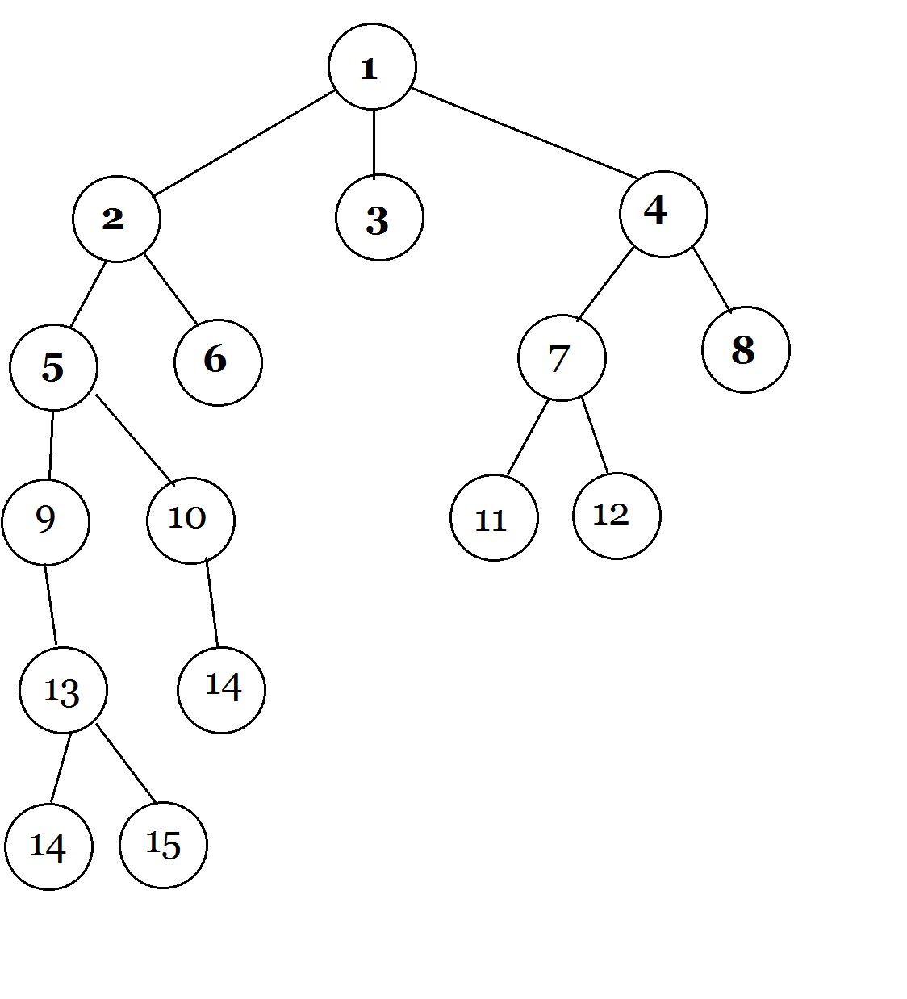

# Implementation
Generally, my solution to the problem was to create a undirected graph and then search through it using breadth first search.
Using the data from `batch_payment.txt` I parsed each line using the ", " deliminator in order to track `id1` and `id2`. To implement all the features that were required, some connection between all the ids had to be made. To make this connection, I envisioned a graph/tree would be a good way in terms of time and space complexity to represent the data. In order to do this, the data structure I choose to use was a dictionary with the `key` being `id1` and `value` being `id2`.

In order to handle the transactions in `stream_payment.txt` there needed to be an efficient way to search through the graph/tree I just created. Since feature 3 would require the maximum depth to search through to be 4, breadth first search was the algorithm implemented.

All 3 features that were required for this project were implemented. No other features were implemented.

## Test files
In the ./insight_testsuite/my-own-test there are two folders; `test1-small` and `test2-large`. `test1-small` was a relatively small data set I created in order to test the functionality of my program. The ids are simple numbers from 1 to 15. 
Here is an visual representation of the data I created. Please excuse my poor drawing.

In `stream_payment1.txt`, I designed it to test functionality for all 3 features as well as edge cases such as searching for a path where id1 has never been linked to id2 and searching for a path from id1 to an nonexisitng id2.

In `test2-large` I took partial data from the csv files provided and ran it through my program to see how it would handle large files. Of course, since I can not know the solution to that particular data set, this test was not to check for correctness. One thing to note here is that, I think that definietly the time complexity of my implementation can be improved.

### Notes
In handling the transactions in `stream_payment.txt` I was not sure if a value of `trusted` meant I should update the database and so I did not implement that feature. I only processed the transaction and did not change the database regardless of the value returned.
